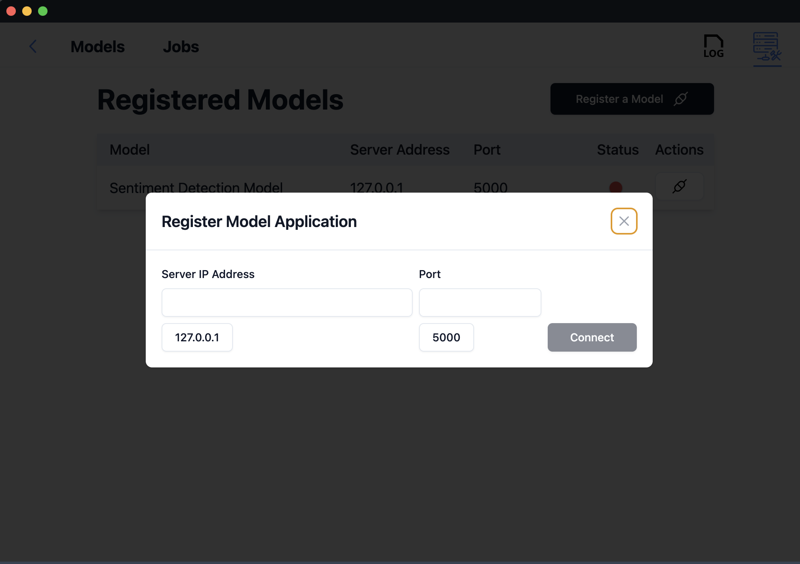
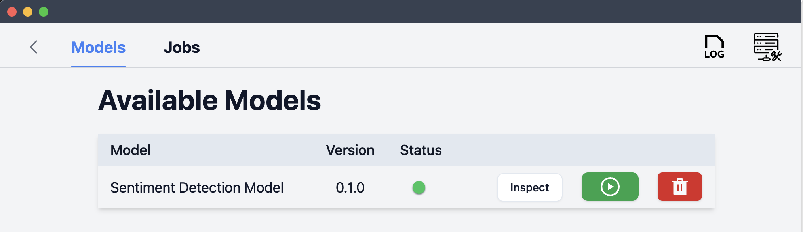
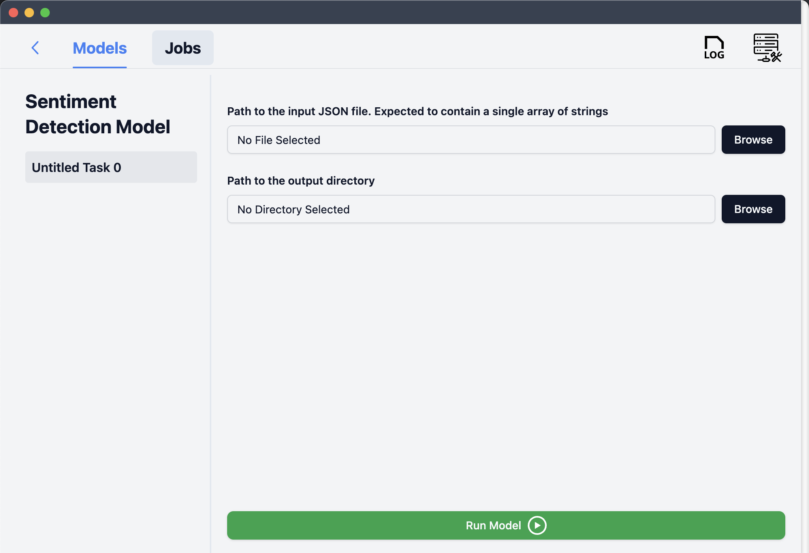
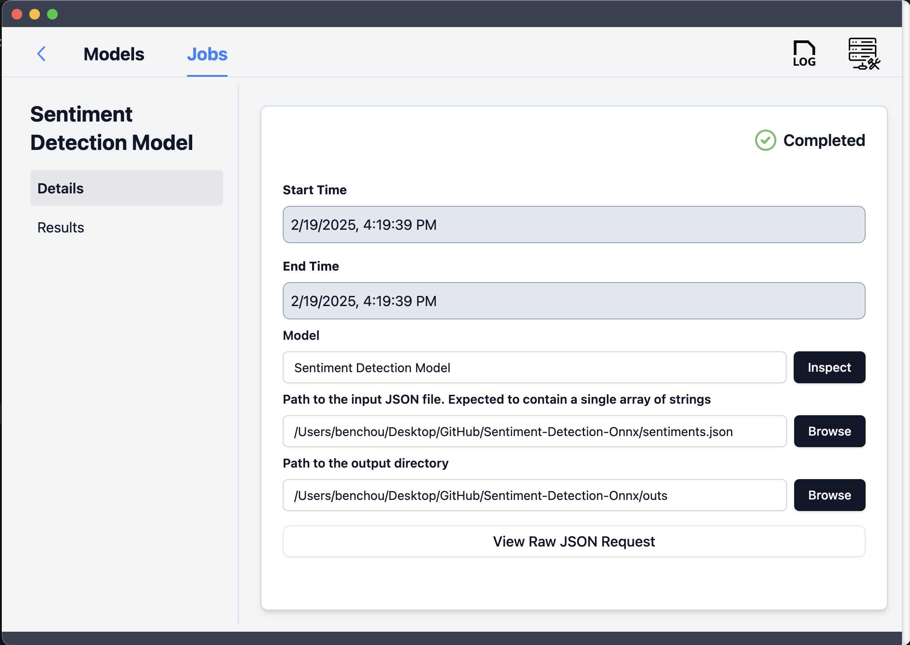

# Sentiment Detection Onnx
 Onnx port of sentiment detection for 596E

## Steps to export the ONNX model

Exporting the ONNX model involved the following key steps:
1. Clone and set up the Sentiment Analysis repo found [here](https://github.com/Srikrushna221/Sentiment_Detection_From_Text). Follow instructions on README.md to get the predictions for the BERT model running.

2. replace the first part of the 'helper' function in Sentiment_Detection_Models.py by.
```python
        import torch
        device = torch.device("mps" if torch.backends.mps.is_available() else "cpu")
        classifier = pipeline(
            "text-classification",
            model="bhadresh-savani/distilbert-base-uncased-emotion",
            return_all_scores=True,
            device=-1
        )
        underlying_model = classifier.model.to(device)
        from transformers import AutoTokenizer
        import torch.onnx 
        tokenizer = AutoTokenizer.from_pretrained("bhadresh-savani/distilbert-base-uncased-emotion")
        tokens = tokenizer(text_list, padding=True, truncation=True, return_tensors="pt").to(device)
        #Export the model to ONNX format
        torch.onnx.export(
            underlying_model,
            (tokens["input_ids"], tokens["attention_mask"]),
            "distilbert.onnx",
            export_params=True,
            input_names=["input_ids", "attention_mask"],
            output_names=["output"],
            dynamic_axes={"input_ids": {0: "batch_size", 1: "sequence_length"}, "attention_mask": {0: "batch_size", 1: "sequence_length"}, "output": {0: "batch_size"}},
            opset_version=16
        )
        exit()
```
3. Run the code using: 
```bash
python Sentiment_Detection_Models.py --model distilbert --input_type text --input "I am happy" "I am sad" "I am angry" "Tornadoes are scary"
```
4. The above tokenizes the inputs and produces the model.


The resulting ONNX model will be saved as "distilbert.onnx" in root directory.

## Steps to use the sentiment detection model

### Create virtual environment and install dependencies
Create a new virtual environment using any tool you prefer. I used venv

```bash
pipenv shell
```

Install the dependencies using the following command:

```bash
pip install -r requirements.txt
```

### Download the model
Download the model from the following link: [Sentiment Detection Model](https://drive.google.com/file/d/1zaf3zw8C7dm06mYft-NWBJ5fwjFt67Ng/view?usp=sharing). Place the model in the root directory of this project.

### Run the Flask-ML server

Run the following command to start the Flask-ML server:

```bash
python model_server_onnx.py
```

### Command line interface

The command line interface can be used to test the model. Run the following command to test the model:

```bash
# image_dir is the directory containing the images. the csv might need to exist beforehand.
python3 sentiment_cli.py --input inputfile.json --output outputfile.csv
```

### Download and run RescueBox Desktop from the following link: [Rescue Box Desktop](https://github.com/UMass-Rescue/RescueBox-Desktop/releases)

#### Open the RescueBox Desktop application and register the model


#### Run the model



#### View the results


### Attribution
The original repo is by students in the Fall 24 offering of 596E. Their work has been modified to work with ONNX models here. Their repo can be found [here](https://github.com/Srikrushna221/Sentiment_Detection_From_Text).